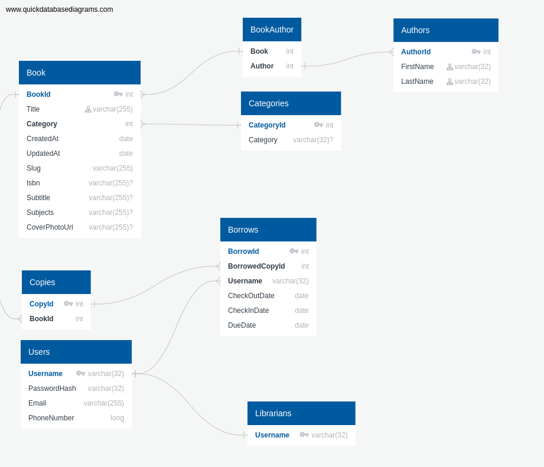

# Bookish

## Database

The database will consist of eight tables
* Books
* Authors
* BookAuthor
* Categories
* Copies
* Borrows
* Users
* Librarians

| Title | Desc | 
|-------|------|
| Books | Every unique book in the system |
| Authors | Every unique author in the system |
| BookAuthor | A join table to prevent the many to many between books and authors, each row will map a book to an author|
| Categories | Each row will contain a unique category under which each of the books fit |
| Copies | Lists the copies of each book, one book can have many copies |
| Borrows | Every borrow of a book, past or current is listed here, each book is borrowed individually, bulk transactions are intended |
| Users | Every user of the system has a row |
| Librarians | A single column table indicating which users are librarians |

## Backend

* Spring server
* Rest controller
* Authrorized with jwt tokens

## Frontend

* Angular(?)

## Infrastructure

* Docker(-compose)

Copyright © 2018 Softwire - All Rights Reserved
